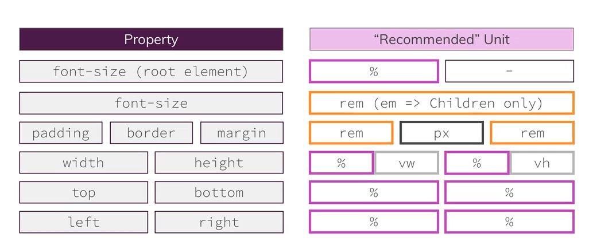
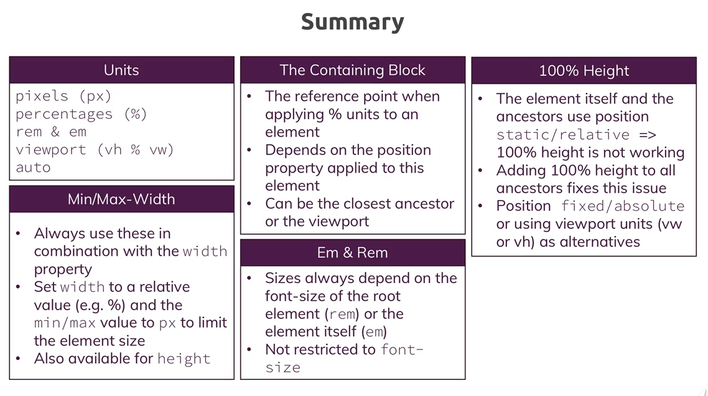

# Complete guide of CSS

Repo for learning css from basic to advance

## 1. BASIC GUIDES

### 1.1. FONT-FAMILY: Changing the font-family of the text node

Following the guide of the fonts page of google fonts:

<https://fonts.google.com/>

```html
<link rel="preconnect" href="https://fonts.gstatic.com" />
<link
  href="https://fonts.googleapis.com/css2?family=Roboto:wght@100&display=swap"
  rel="stylesheet"
/>

...
<style>
  h1 {
    font-family: "Roboto", sans-serif;
  }
</style>
<style>
  h1 {
    font-family: inherit;
  }
</style>
```

### 1.2. COMBINATORS: Type of combinators (Adjacent, General, Child, Descendant)

ADJACENT: p that following by h2 tag will be applied

```css
h2 + p {
  color: red;
}
```

GENERAL: p that having h2 with the same level will be applied

```css
h2 ~ p {
  color: red;
}
```

CHILD: p that are directed child of div will be applied

```css
div > p {
  color: red;
}
```

DESCENDANT: p is a descendant of the div (not care of which level)

```css
div p {
  color: red;
}
```

### 1.3 BOX-MODEL: The basic approach

Every element in html will be understand as a box inside CSS (in debug)

#### 1.3.1. The default margin 8px of body tag

The body tag having the default margin of 8

```css
body {
  margin: 0;
}
```

#### 1.3.2. Margin Collapsing

The margin bigger of element will cover the other -> this is a css features

#### 1.3.3. Shorthand properties

Combine values of multiple props in a single property

```css
/* Normal way */
body {
  border-width: 2px;
  border-style: dashed | solid;
  border-color: orange;
}
/* Shorthand way */
body {
  border: 2px dashed orange;
}

body {
  margin: 5px 10px 5px 10px; /* top right bottom left */
  margin: 5px 10px; /* top + bottom lef + right */
}
```

#### 1.3.4. HEIGHT & WIDTH: Cool trick to set height of element

We'll learn other dimension and measure unit but in here just remember:

1. The child element get height % with the parent.
2. So set height of html tag -> body tag -> parent -> child to 100% to get full page width.

THE CONTENT BOX: the default box-sizing of element -> if set width: 100% and set padding border and margin -> the total will exceed the width.

-> To solve this we should set the box-sizing to border-box:

```css
div {
  width: 100%;
  height: 528px;
  padding: 10px;
  border: 5px solid black;
  box-sizing: border-box;
}
```

> Margin should not be part of the height and width.

We could override the default to border-box with universal selector:

```css
* {
  box-sizing: border-box;
}
```

#### 1.3.5. DISPLAY PROPERTY: config the display of element

inline-block: display inline but still behave like block element when setting TOP & BOTTOM. Sit inline but style like block.

vertical-align: set in both inline-block elements to get them middle.

calc(100% - ?px)

#### 1.3.6. PSEUDO: Pseudo class and Pseudo elements

CLASS: Defines the style of a special state of an element (:classname)
<https://developer.mozilla.org/en-US/docs/Web/CSS/Pseudo-classes>
ELEMENT: Defines the style of a specific part of an element (::elementname)
<https://developer.mozilla.org/en-US/docs/Web/CSS/Pseudo-elements>

Example of pseudo class and element:

```css
.main-nav__item a::after {
  content: " (Link)";
  color: red;
}

p::first-letter {
  color: red;
}
```

GROUPING RULES:

```css
.main-nav__item a:hover,
.main-nav__item a:active {
  color: white;
}
```

### 1.4. MORE ON SELECTORS

#### 1.4.1. More on CSS Class

```css
/* Select the a tag with class of active */
a.active {
}
```

#### 1.4.2. The :not() pseudo class

<https://developer.mozilla.org/en-US/docs/Web/CSS/:not>

```css
a:not(.active) {
  color: blue;
}
```

#### 1.4.3. The box-shadow property

For dropping shadow on the element

```css
.plan-highlighted {
  box-shadow: 2px 2px 2px 2px rgba(0, 0, 0, 0.205);
}
```

#### 1.4.4. Basic sample to set up css for button

```css
.button {
  background-color: #0e4f1f;
  color: white;
  font: inherit;
  border: 1.5px solid #0e4f1f;
  padding: 8px;
  border-radius: 8px;
  font-weight: bold;
  cursor: pointer;
}

.button:hover,
.button:active {
  color: #0e4f1f;
  background: white;
}

.button:focus {
  outline: none;
}
```

#### 1.4.5. Outline of the default browser

The default wrapper of browser (not include in the box model)
In the button, we can check that in the focus state.

```css
.button:focus {
  outline: none;
}
```

#### 1.4.6. The float and clearfix for fixing the float (the following element)

The float will remove the element from the dom display -> the next el will overflow to the place the element has left.

-> using clearfix to fix the float problem.

#### 1.4.7. Fixing the border-left when using in id selector

The best practice is to define the new border-left-color in hover and active instead of using !important

```css
#free:hover,
#free:active {
  border-left-color: #ff5454;
}
```

### 1.5. POSITIONING

#### 1.5.1. Basic of position prop

- The default for postion prop is static.
- Others: absolute, relative, fixed, sticky.

THE CONCEPT: top, bottom, left, right -> apply to document flow. Positioning Context.

#### 1.5.2. The fixed value

- Stick to the viewport
- Using top, bottom, left, right to position

```css
.main-header {
  width: 100%;
  background: #2ddf5c;
  padding: 8px 16px;
  /* If html element config the margin then top and left need to be used */
  /* top: 0; left: 0; */
  position: fixed;
}
```

Using fixed to render the background image

```css
.background {
  background: url(../images/plans-background.jpg);
  position: fixed;
  width: 100%;
  height: 100%;
  z-index: -1;
}
```

The z-index: The default value of z-index is 0 (auto)

#### 1.5.4. The absolute value

The absolute value render will depend on the ancestor.
-> If ancestor NOT have position prop -> attach to the html element
-> If HAVE -> attach to the ancestor

Example of using relative and absolute to hook the recommend text inside the package box:

```css
.package {
  width: 80%;
  margin: 16px 0;
  border: 4px solid #0e4f1f;
  border-left: none;
  position: relative;
}

.package__badge {
  position: absolute;
  top: 0;
  right: 0;
  margin: 20px;
  font-size: 12px;
  color: white;
}
```

#### 1.5.5. The relative value

Define how the element should move from it's current position. (other based on the position of parent)

#### 1.5.6. The stacking context

#### 1.5.7. Summary of Position

### 1.6. BACKGROUND AND IMAGES

#### 1.6.1. Background props

- background-size: 100% auto, cover. Config size of the background image (w h)
- background-repeat: reapeat, no-repeat, repeat-y, repeat-x

When setting background-size to 100% (w) -> the image crop to fit the height but keeping the aspect ratio.

- background-position: x y. Define how left and top of image position in relation to container. If set to % -> percent of excess space go in to the top or left.

  > center the image by setting background-postion: 50% 50%. 50% excess will be cropped at the top -> 50% remain go to bottom.

- background-origin: border-box (default is content-box -> without border and padding). Use to fit image to cover through the border as well. Other value: padding-box.
- background-clip: padding-box. Where the image should be clipped if necessary.
- background-attachment: fixed (scroll, local)

```css
background-size: cover;
background-repeat: no-repeat;
background-position: center;
background-position: left 10% right 20%;
background-origin: border-box;
border: red dotted 10px;
```

Shorthand for all of the above setting:

```css
background: url("./freedom.jpg") left 10% bottom 20% / cover no-repeat
  border-box;
```

#### 1.6.2. Styling the images

#### 1.6.3. Using the Gradients

Gradients are like using the normal background image.

The default of gradient is from top to bottom (vertical)

```css
/* LINEAR GRADIENT */
background-image: linear-gradient(to left bottom, red, blue);
background-image: linear-gradient(30deg, red, blue);
background-image: linear-gradient(
  to bottom,
  red 70%,
  blue,
  green,
  transparent,
  rgba(0, 0, 0, 0.5)
);

/* RADIAL GRADIENT */
background-image: radial-gradient(circle, red, green);
background-image: radial-gradient(circle at 20% 50%, red, green);
background-image: radial-gradient(circle 20px 80px at 20% 50%, red, green);
background-image: radial-gradient(
  ellipse farthest-side at 20% 50%,
  /* farthest-corner, closest-side, closest-corner */ red,
  green,
  blue
);
```

#### 1.6.4. Using Multiple Backgrounds

Set different background by using "," seperator.

```css
background: linear-gradient(to top, rgba(80, 68, 18, 0.6) 10%, transparent),
  url("images/freedom.jpg") left 10% bottom 20% / cover no-repeat border-box, #ff1b68;
```

#### 1.6.5. Using Filters

> <https://developer.mozilla.org/en-US/docs/Web/CSS/filter>

### 1.7. SIZES AND UNITS

The problem of em: EM inherits size of previous sizes and multiply em with previous em.
REM: em but using the root element only (not inherit from the previous em).

#### 1.7.1. Recommended unit base on the elements



#### 1.7.2. Center the element

Using the margin auto.

> Margin auto only works for block level elements with an explicitly assigned width

#### 1.7.3. Summary of the units and sizes module



### 1.8. ADDING JS TO CSS

1. Using the querySelector -> el.style.display = none;

2. Coding of side nav (for mobile)

### 1.9. MAKING OUR WEB RESPONSIVE

#### 1.9.1. Hadware pixels vs Software pixels

<https://www.mydevice.io/#compare-devices>

Pixel ratio: The physical w/h / pixel-ratio -> CSS w/h

> Add the meta tag viewport -> The browser will have ability to recognize the device

```html
<meta
  name="viewport"
  content="width=device-width, initial-scale=1.0, user-scalable=yes, maximum-scale=2.0, minimum-scale=1.2"
/>
```

#### 1.9.2. Different between the viewport meta tag and @media

The viewport -> translate the pixel base on the device -> no design changes.

@media: change the design depend on the size.

> DESIGN MOTTO: MOBILE FIRST

#### 1.9.3. Using the @media query

> @media is like the if statement
> For the mobile first design -> any code inside @media will be for the desktop ->

```css
@media (min-width: 40rem) {
  #product-overview {
    height: 40vh;
    background-position: 50% 25%;
  }
}
```

The code css will be cascade -> codes that come after will take into action.

-> The @media should in the end of css files.

> The break point to use in @media query: Ref the website <https://www.mydevice.io/#compare-devices>

#### 1.9.3. Some conditions of the media query

```css
/* AND */
@media (min-width: 40rem) and (min-height: 40rem) {
}
@media (min-width: 40rem) and (orientation: portrait) {
}

/* OR */
@media (min-width: 40rem), (orientation: portrait) {
}
```
